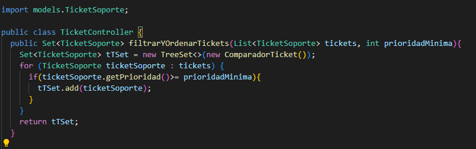
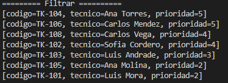

# Evaluacion Set y Map 
## Metodo A: filtrarYOrdenarTickets
Implementacion utilizada:

Explicacion:
Utilice un TreeSet porque esta implementacion me ayuda a trabajar con un comparador en ese comparador use un implements de comparator porque me permite comparar dos objetos, compare prioridad y tecnico si en prioridad me retorna un 0 al igaual que tecnico significa que son iguales y ahi estoy validando la unicidad de los datos, es deir que no van a existir repetidos y el comparador lo hice en otra clase aparte de la de ticketSoporte para no modificar nada ahi. Con respecto al orden bueno primero compara la priorridad de forma descendente y si existen dos valores iguales pasa al tecnico y lo ordena de forma ascendente. bueno en mi metodo filtrar primero instancio set y en el constructir de treeSet instancio mi metodo para que se pueda trabajar el comparador, luego recorro ticketSoporte y coloco la condicion de prioridadminima si se cumple la condicion se va añadendo caso contrario se elimina y al final retorno mi tTSet.

Salida en consola:

## Metodo B: agruparCodigosPorPrioridad
Implementacion utilizada:
Explicacion:
Utilice un TreeMap porque esta implementacion ayuda a ordenar alfabeticamente lo que hice en mi metodo fue trabajar como clave string y valor una lista de string luego instancie el map y cree el mapa luego recorro ticketSoporte y coloco las condiciones de Alta media y baja. Luego obtengo del codigo colo los numeros usando split luego usando ela lista de String la igualo a mi grupos obteniendo el rango luego si en listagrupos no existe el numero lo añade caso contraio no lo hace y al final retorno mid grupos.

